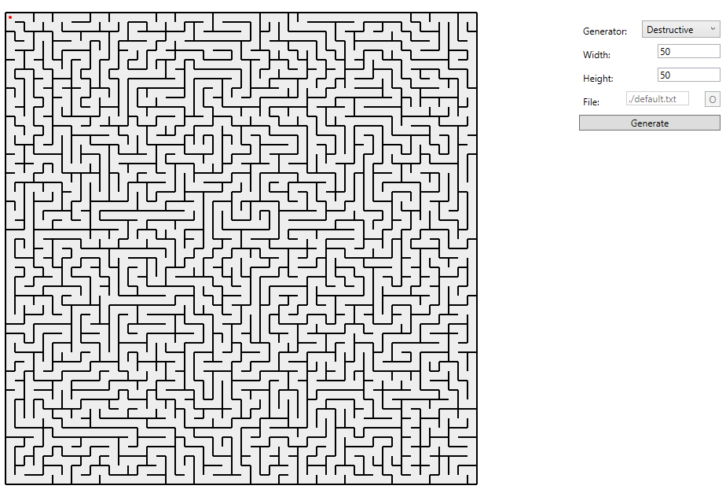

# WPF Maze generator

## projectstructuur
- Components
	- bevatten data stores die aan datastructuren kunnen worden meegegeven via de constructor enkel als deze nodig zijn
	- IComponent (base interface)
	- MazeConstructionComponent (bevat data nuttig voor generators)
	- WallDataComponent (nuttig voor physics en rendering)
	- GeneratorRequirementComponent (bevat extra datastore dat generators dynamisch kunnen aanvullen in de vorm van een dictionary)
- Datalaag
	- klassen en interfaces voor interactie met externe data
	- FileManager (uitlezen van bestanden)
- ExtensionMethods & UtilityFunctions
	- self explanatory 
- [Generators](Generators)
	- interfaces & klassen voor maze generators en maze generator factory
	- IMazeGenerator
	- IMazeGeneratorFactory
	- MazeGeneratorFactory
	- StaticGenerator
	- RecursiveBacktrackingGenerator
	- RecursiveDivisionGenerator
- [Globals](Datastructuren)
	- bevat datastructuren (kan dus ook Models genoemd worden)
	- Maze
	- Cell
	- Ball
	- enum MazeGeneratorTypes (gebruikt in factory)
- Runnable Projecten
	- Console_Test_Environment
	- WPF_maze_generator
	- WPF_physics_simulator (leeg)

## Datastructuren
maze is een simpele collectie van cellen. Voor interne cellen wordt verder ook hun buren aangevuld (zie hieronder `Cell`)
```
Maze
	- readonly int Width, Height
	- readonly Cell[,] cells
```

Cell bevat velden voor Neighbours voor gebruik bij het aanpassen van muren.
Zo kan als bij een cel de rechtermuur wordt aangepast in de rechtercel meteen de linkermuur aangepast worden(zie verder [muren updaten](#muren-updaten));  
Bovendien is het ook sneller om een graph te maken omdat vanuit cell een referentie is naar de gevraagde naburige cel. \
cellen kunnen optioneel ook andere componenten bevatten die gebruikt worden door andere systemen (rendering, physics, genereren, etc.);
Deze worden via de constructor megegeven
```
Cell
	- readonly int X,Y /*index of cell*/
	- Cell[4] Neighbours
	- readonly bool[4] walls
	- private readonly IComponent[]
	- public IComponent? GetComponent(Type<IComponent> ComponentType)
```

voor later gebruik horen X, Y aanpasbaar te zijn, grootte van de bal mag wel constant blijven
```
Ball
	- int X, Y
	- readonly int Size
	- private readonly IComponent[]
	- public IComponent? GetComponent(Type<IComponent> ComponentType)
```

### muren updaten

in cellen zit een methode `SetWall(int index, bool isSet, optional bool cascade=true)`  
met deze methode kan de cel zijn muren aanpassen met `walls[index] = isSet`;
Moest cascade `true` zijn zal ook de cel aan de overkant van de muur(`Neighbours[(index+2)%4]`) aangepast worden maar zal verder geen cascade meer gebeuren.

## Generators

### StaticGenerator
de statische generator maakt gebruik van een string representatie van muren per cell met volgende structuur  
(1: muur bestaat; 0: muur bestaat niet)
```
maze_breedte maze_hoogte  
muur_boven muur_rechts muur_onder muur_links   
...  
```
waarbij bestaande muren niet bestaande muren overschrijven; muren worden van links naar rechts ingevuld;
er mogen meer muren gedefinieerd zijn dan de gegeven grootte (`breedte*hoogte`) maar deze worden genegeerd
zo is bijvoorbeeld de configuratie
```
2 2
1 0 0 1
1 1 0 0
1 0 1 1
0 1 1 _
```
de definitie voor volgend doolhof ( _ mag beiden 0 of 1 bevatten)
```
.--.--.
|     |
.  .  .
|  |  |
.--.--.
```

#### Technische keuzes
- er werdt gekozen om lege muren niet te plaatsen zodat dit een additief algoritme wordt;
  Zo zijn de verwachtingen van string data ook iets laxer in geval de gebruiker een fout maakt in die data.


### Recursive Backtracking Generator

#### Algoritme

- kies een willekeurige cel
- markeer de cel als bezocht, dit is je startpunt
- zolang je niet bezochte cellen bestaan
  - kies een niet bezochte buur
  - maak een gang tussen de huidige cel en die buur
  - markeer de buur als bezocht
  - de huidige cel wordt de net gekozen buur
  - als geen buren bestaan keer terug naar de vorige cel
- wanneer geen onbezochte cellen bestaan is het doolhof gemaakt

#### Technische keuzes
- Er is gebruik gemaakt van een `Stack<Cell>` in plaats van recursie om geen (of in ieder geval een veel hoger)
 limiet van celdiepte te hebben aangezien dit algoritme vrij diepe recursie kan genereren (worst case = O(n*m))

- Er wordt gebruik gemaakt van de GeneratorRequirementComponent als data store om bij te houden of de cel al bezocht geweest is
  er is voor deze manier gekozen omdat niet elke generator dit in een cel moet markeren en een cel dus geen veld voorziet om deze data bij te houden

- Voor het kiezen van een geldige buur wordt van linq gebruik gemaakt vanwege deze implementatie moet bij het aanpassen van muren eerst bij
  de huidige cel de index van de buur gezocht worden om de index van de muur te bepalen; Door het cascade mechanisme van setWall moet die functie enkel op de huidige cel toegepast worden

### Recursive Division Generator

#### Algoritme
- selecteer de eerste sectie als het volledige doolhof
- zolang deelbare secties bestaan (minumum 6 cellen groot of met vorm 2x2)
  - deel de zone horizontaal of verticaal
  - plaats een muur langs de volledige deellijn
  - maak een gat ergens in de net gebouwde deellijn
  - herhaal voor elk van de nieuwe gegenereerde (kleinere) secties
- optioneel: bouw buitenmuren

#### Technische keuzes

- net zoals de vorige generator is hier ook van een Stack gebruik gemaakt;
  In dit geval is het echter `Stack<int[4]>` waar elke `int[4]` de index en van de linkerbovenhoek en rechteronderhoek van een sectie bijhoudt.
- secties van 2x2 worden alsnog verwerkt omdat anders een cirkel ontstaat (ga steeds links of rechts in dit vierkant)
- secties met breedte of hoogte 1 worden overgeslaan aangezien 1 van de richtingen niet deelbaar is en in de andere de geplaatste muur toch weer meteen wordt weggehaald,
  dit is dus een nuloperatie en vraagt vervolgens meer resources dan nodig zijn (de gedeelde secties worden anders ook aan de stack toegevoegd en creëren dan nog meer nuloperaties)
- er werdt gekozen voor secties met minimum 6 cellen omdat een sectie met 5 (of minder; uitzondering bij 2x2) cellen enkel kan delen in (2x1; 3x1) secties
  waarbij 2x1 een te kleine sectie is om toe te laten
- in plaats van 50/50 willekeurig te kiezen voor de richting van delen wordt `bool horizontaal = RandomDouble()>itemWidth / (itemHeight + itemWidth`
  gebruikt, bij 50/50 lijkt namelijk een bias te zijn voor lange smalle gangen, met deze formule wordt de bias naar eerder vierkantige secties geduwd

## Grafische Applicatie

in de grafische applicatie zijn velden voorzien voor
- het selecteren van generator
- breedte en hoogte van het doolhof (default 11) (enkel non static generator)
- het selecteren van een tekstbestand (default = "./default.txt") (enkel static generator)

Er is ook een Canvas(600x600) aanwezig waar het doolhof op gerenderd wordt,
de grootte van de getekende cellen wordt dynamisch aangepast aan de grootte van het doolhof `breedte/#cellen`

Als errors gegenereerd worden komen die onder de "Generate" knop

Op het doolhof wordt ook een bal getoond die in een volgende stap (link volgt) zal dienen als "solver" van het doolhof; ook deze bal wordt dynamisch geschaald naar de grootte van het doolhof en zal half zo groot zijn als een cel.

Een praktische grens op het genereren van doolhoven staat op maximaal 200x200 in grootte, hierna zou een groter doolhof toch niet meer duidelijk zichtbaar zijn.


---
# WPF Physics Simulator

## Aanpassingen datastructuren
Ball klasse
  - X int -> double
  - Y int -> double

nieuw object Rect
  - x1, y1, x2, y2 double (= hoekpunten)
  - source cell int (optimizatie, zie later)
  - Mark bool (debug flag)
  - Collides bool (debug flag)

nieuw object Vector (te vinden in components wegens project reference issues; required by PhysicsComponent)
  - X double (= x component van de vector)
  - Y double (= y component van de vector)
  - Length double (property, berekend met pythagoras)
  - default constructor met waarden 0,0
  - constructor met parameters x en y

nieuw component PhysicsComponent: collectie vectoren
  - velocity Vector
  - acceleration Vector
  - force Vector

physicsSimulator klasse (zie later)
  - Environment List<Rect> (2d objecten die deelnemen aan de berekeningen van botsingen)
  - PhysicsObject Ball (de bal in het doolhof)
  - Solved bool (variablele die true wordt gezet als het doolhof wordt bijgehouden)  

__een doolhof wordt beschouwd opgelost te zijn als de bal in de laaste cel (rechtsonder) terecht komt__

## Program flow
- een nieuwe maze generator wordt opgesteld (in deze implementatie is dit een static maze generator, dit is aan te passen lijn 55 en 56 van MainWindow.xaml.cs)
- de init functie wordt opgeroepen
  - genereer een nieuw doolhof
  - genereer een nieuwe bal; positie = midden 1e cel, grootte = halve cel, componenten + physicscomponent
  - bereken physicsObjects (List<Rect> met 1 Rect voor elke muur; elke muur krijgt een value assigned gebaseerd op de cel waar hij toe behoord)
  - genereer 3D models voor elk physics object in physicsObjects hierboven gegenereerd
  - maak een nieuw physicsSimulator object met de hierboven aangemaakte objecten (maze, bal, physicsObjects) en cellsize
  - zet tracked values (fps, framecounter, X angle, Y angle) op startwaarden (=0)
- initializeer een stopwatch (deze wordt nu ook gestart)
- zet CompositionTarget.Rendering target (zie Loop)

## Rendering
- maak de scene leeg
- maak een nieuwe model group
- als debug modus aan staat (boolean flag in code) worden de 3D models opnieuw berekend (slecht voor performance)
  - alle muren beschouwd als mogelijkse collision targets worden in het rood aangeduid (Mark flag in Rect)
  - alle muren waarmee botsing is worden groen aangeduid (Collides flag in Rect)
  - andere muren worden wit aangeduid  
  __aangezien physicsSimulator nog niet heeft gerunt op initializatie zullen alle muren wit blijven als debug niet aanstaat__
- elk van de eerder berekende 3D models wordt toegevoegd aan de 3D model group (3D models eenmaal berekend in init of herberekend in debug modus)
- een nieuw 3D model voor de bal wordt gegenereerd (rood) en wordt aan de model group toegevoegd
- transformaties worden uitgevoerd  
__zie bestand RenderingTools.cs voor utility functions voor het aanmaken van 3D models en transformaties__

## Physics Simulation

### Collision checks
testen op botsingen tussen een bal (cirkel) en een muur(=rechthoek) wordt bepaald op basis van een algoritme gevonden op https://stackoverflow.com/questions/401847/circle-rectangle-collision-detection-intersection
- als de cirkel te ver van het midden van de rechthoek ligt is overlapping onmogelijk -> return false
  * breedte of hoogte /2 + r < (afstand center rect & center bal)
- als de afstand tussen het midden van de cirkel en het midden van de rechthoek kleiner is dan 1 van van beide breedte of hoogte (respectievelijk voor x of y) botst de cirkel -> return true  
  __aangezien de cirkel niet buiten het bereik van straal + breedte/2 ligt wordt de directe regio buiten de rechthoek met lengte straal ook beschouwd als botsend (op stackoverflow pagina: oranje regio)__
- als de afstand tussen een hoekpunt en het midden van de cirkel kleiner is dan de straal wordt ook een botsing gerekend
  - maakt gebruik van pythagoras: dist = (afstand_centrum_x - breedte/2)^2 + (afstand_centrum_y - hoogte/2)^2
  - return dist<=r^2 (er wordt geen vierkantswortel getrokken aangezien de vergelijking met kwadraten evenwaardig is)
  - elk hoekpunt is gelijkwaardig in berekening aangezien alle wiskunde wordt beschouwd ten opzichte van het midden van de rechthoek en het gebruik van de 2e macht die alle waarden positief maakt

### Logica
- krachten op de bal worden berekend door volgende formules (met g=9.81)
  - Force.X = g * sin(AngleX);
  - Force.Y = g * sin(AngleY);
- de cel waar de bal zich in bevind wordt bepaald op basis van zijn eigen positie en de grootte van cellen
  - cellen worden van boven naar beneden en dan van links naar rechts genummerd
  - als de bal zich in de laatste cel (breedte * hoogte - 1) bevindt wordt de simulatie ook als opgelost beschouwd
- een lijst van te checken indexen (= naburige cellen) wordt opgesteld (= 9 indexen)  
  __let op: wegens de manier van nummeren gebeurt een wrap around aan boven en onderzijden van het doolhof__
- voor elke rechthoek in de omgeving
  - markeringen op de muur worden weggehaald
  - als de celindex van de muur niet in bovenstaande lijst staat wordt deze muur niet verder behandeld, anders wordt die gemarkeerd als mogelijks target
  - er wordt gecheckt of de muur botst met de bal, zo ja wordt die gemarkeerd als botsend en toegevoegd aan een lijst van botsende muren
  - collision vectors worden berekend (op basis van lijst botsende muren)
  - variabelen in het physicscomponent worden geupdate voor de volgende stap
    - positie += snelheid * dt + versnelling * (dt^2)/2
    - snelheid += versnelling * dt
    - versnelling += kracht * dt / massa

### Collision vector berekening
  - default word aangenomen dat aan geen enkele zijde botsingen zijn (global bijgehouden welke van de 4 zijden een botsing aangaan)
  - als geen items in lijst botsende muren wordt hier gestopt
  - voor elke muur wordt gecheckt aan welke zijde de bal zich bevind, deze zijde wordt algemeen beschouwd als een botsende zijde
  - voor iedere botsende zijde
    - als de relevante snelheidsvector niet al is verwerkt (= in de juiste richting t.o.v. na een botsing staat) wordt die gespiegeld en vermenigvuldigd met elasticiteit (ingesteld 0.2, aanpasbaar)
    - als er nog versnelling is in de richting van de muur wordt die op 0 gezet, anders blijft die wat die is  
    __als na een botsing de snelheid lager is dan een drempelwaarde wordt in plaats de drempelwaarde (ingesteld 8e-3) gebruikt, deze dient om een bal los te maken van een muur als die er in vast zou blijven zitten; lost ook een probleem op bij overgang tussen 2 muren__
  - krachten worden niet aangepast aangezien deze enkel invloed hebben op versnelling die (waar nodig) al op 0 ingesteld wordt


## Loop
- keyboard events
  - O -> tilt naar voor (angleY -)
  - K -> tilt naar voor (angleX -)
  - L -> tilt naar voor (angleY +)
  - M -> tilt naar voor (angleX -)  
  __increments van 2 graden__

- als het doolhof opgelost is wordt de init functie (zie program flow) opnieuw opgeroepen, zo wordt een nieuw doolhof in startcondities gegenereerd
- het aantal gepasseerde milliseconden op de stopwatch wordt opgehaald
- de physics simulatie wordt uitgevoerd op basis van de voorbij gegane tijd sinds vorige keer
- rendering wordt uitgevoerd
- FPS meter wordt elke 30 frames geupdate
- in debug modus worden extra waarden weergegeven (snelheid, versnelling, kracht, etc.)